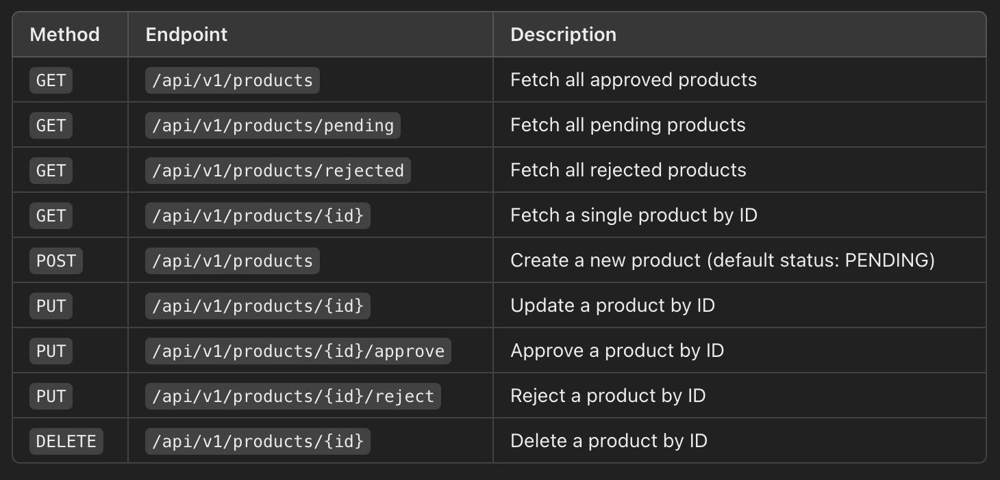

# Product Service API

## Description
Product Management API is a backend service built using Spring Boot and MySQL to manage product data. 
The system supports the following features:

- CRUD Operations: Create, Read, Update, and Delete products.
- Status Management: Products can have statuses like PENDING, APPROVED, and REJECTED.
- Filtering: View products by their statuses (e.g., approved, pending, rejected).
- Integration with Frontend: This backend serves as an API for the Next.js-based frontend.

## Technologies

### Prerequisites
- Java 17 installed.
- Docker and Docker Compose installed.
- Maven installed (if needed for manual builds).
- MySQL image for Docker (already configured in docker-compose.yml).

### Setup
- Clone the repository.
```bash
git clone https://github.com/ivandjoh/product-service-api.git
```

- Navigate to the root directory.
```bash
cd product-service-api
```

- Run to start the `Database MYSQL` service.
```bash
docker compose up --build
```

- Stop the service.
```bash
docker compose down
```

### Build and Run Application
- Run the following command to build the project.
```bash
./mvnw clean install
```

- Run the following command to run the project.
```bash
./mvnw spring-boot:run
```

- Navigate to http://localhost:9000/api/v1/products to access the API endpoints.

### API Endpoints



### Credits
- [Ivandjoh](https://linkedin.com/in/ivandjoh)